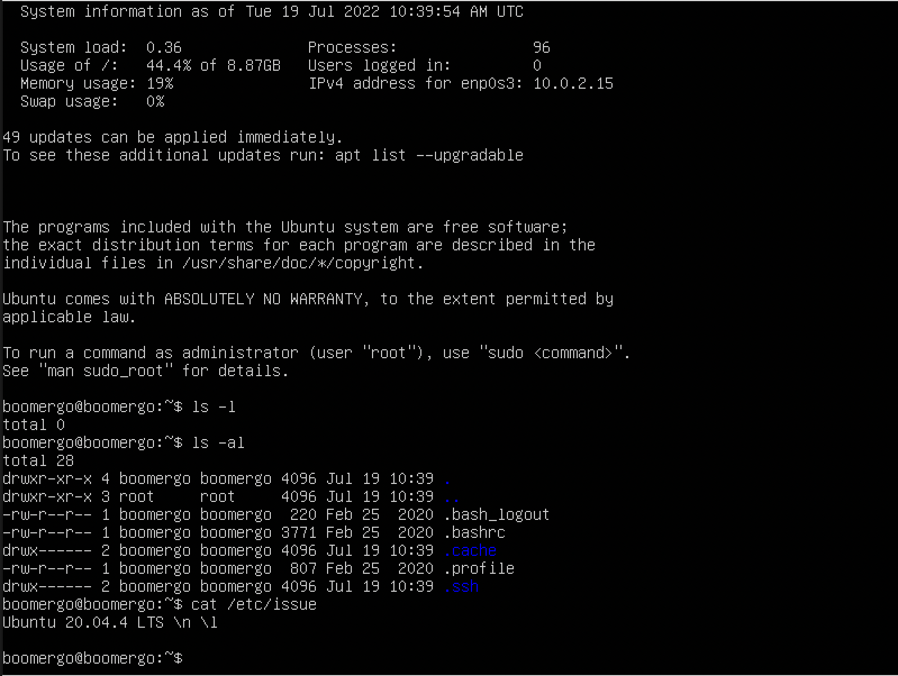

## Part 1 Установка ОС
##### Перед началом работы была установелена **Ubuntu 20.04 Server LTS** без графического интерфейса. (Используя программу для виртуализации - VirtualBox)
- Показан результат команды в терминале `cat /etc/issue.`
- 

## Part 2 Cоздание пользователя
- Пользователь был создан командом `sudo useradd -m Aleksey.` 
    - -m значит что создается home directory для пользователя `Aleksey`
- 
- Пользователь был добавлен в группу `adm` командой `sudo usermod -aG adm Aleksey`
    - -aG - append group (Добавить в группу)
- Показан результат команды `cat /etc/passwd`
- 

## Part 3 Настройка сети ОС
- Задали название машины вида user-1 путем изменения файла `/etc/hostname`
    - 
- Установиk временную зону, соответствующую моему текущему местоположению. `sudo timedatectl set-timezone Europe/Moscow`
    - 
- Вывел названия сетевых интерфейсов с помощью консольной команды `ip link show`
    - lo (loopback device) – используется для отладки сетевых программ и запуска серверных приложений на локальной машине. С этим интерфейсом всегда связан адрес 127.0.0.1. У него есть dns-имя – localhost, тоесть нужно это для взаимодействия программ, которые изначально сетевые, но запускаются на одном компьютере.
    - 
- Dynamic Host Configuration Protocol — протокол динамической настройки узла
    - 
- Как вы поняли, ваш домашний компьютер мог бы иметь внешний IP-адрес доступный всем, но это нецелесообразно как минимум по двум причинам. Во-первых, дорого, во-вторых, очень небезопасно. Поэтому подключение компьютера к интернету сейчас выглядит приблизительно так:
    1. Внешний и доступный всем IP, который принадлежит провайдеру и используется для выхода в интернет сотен пользователей;
    2. IP-адрес вашего роутера в локальной сети провайдера, той самой, с IP-адресом которой вы выходите в интернет. Он не доступен из интернета и, скорее всего, вам не понадобится;
    3. IP-адрес вашего компьютера в локальной (домашней) сети, созданной роутером, к которой вы можете подключать свои устройства. Именно он используется для взаимодействия между устройствами в локальной сети и отображается в информации о сетевом интерфейсе;
    4. Внутренний IP-адрес компьютера, недоступный извне и используемый только для внутренних коммуникаций в системе.
    - Внутренний и внешний адресса посмотреть можно командой `ip route`
        -
- Задаем статичные (заданные вручную, а не полученные от DHCP сервера) настройки ip, gw, dns (использу публичный DNS сервер 1.1.1.1).
    - для этого заходим в файл по пути `sudo vim /etc/netplan/00-installer-config.yaml` и меняем данные на данные указанные на скриншоте
    - 
- Пропингуем удаленные хосты 1.1.1.1 и ya.ru
    - 
    - 

## Part 4 Обновление ОС
- Обновим подключенные к нашей системе репозитории с пакетами командой `sudo apt-get update`
    - 
- Обновим системные пакеты командой `sudo apt-get dist-upgrade`,  вызовем ее повторно чтобы увидеть что все обновлено
    - 

## Part 5 Использование команды **sudo**
- Добавим пользователя Алексей в группу `sudo`, чтобы он мог пользоваться командой sudo командой `sudo usermod -aG sudo Aleksey`
    - 
- Команда судо дает права суперпользователя, тоесть дает привилегии выполнять команды от имени root.
- Зайдем под пользователем Aleksey командой `sudo su Aleksey`
    - Поменяем hostname например на имя user-2 командой `sudo hostnamectl set-hostname user-2`
        -

## Part 6 Установка и настройка службы времени
- Устанавливаем синронизатор времени NTP командой `sudo apt-get install ntp`
    - Добавляем NTP-сервера, с которыми будем синхронизировать время внося название серверов в файл по пути `/etc/ntp.conf`
        - 
    - Настраиваем автоматическую синхронизацию при каждой загрузке ОС. Для этого открываем конфигурационный файл `/etc/rc.conf` где ставим `ntpd_enable=»YES»`
    - Синхронизируем наше время с временем от ntp по адрессу `/etc/systemd/timesyncd.conf`
        - 
    - Результат команды `timedatectl show`
        - 

## Part 7. Установка и использование текстовых редакторов
- Используя каждый из трех выбранных редакторов, создаk файл *test_X.txt*, где X -- название редактора, в котором создан файл. Напишиcfk в нём свой никнейм, закрыл файл с сохранением изменений.
    - Использовал редактор vim, для выхода из файла с сохранением была использована команда `:wq`
        - 
    - Использовал редактор nano, выход из файла с сохранением комбинацией клавиш `CTRL+X` с последущей командой `Y`
        - 
    - Использовал редактор joe, нажатием `CTRL+K+X`
        - 
- Используя каждый из трех выбранных редакторов, открыл файл на редактирование, отредактировал файл, заменив никнейм на строку "21 School 21", закрыл файл без сохранения изменений.
    - Использовал редактор vim, для выхода из файла без сохранения была использована команда `:q!`
        - 
    - Использовал редактор nano, выход из файла без сохранения комбинацией клавиш `CTRL+X` с последущей командой `N`
        - 
    - Использовал редактор joe, нажатием `CTRL+K+Q` можем выйти в меню выхода, нажимаем не сохранять перед выходом
        - 
- Используя каждый из трех выбранных редакторов, отредактировал файл ещё раз (по аналогии с предыдущим пунктом), а затем освоил функции поиска по содержимому файла (слово) и замены слова на любое другое.
    - Использовал редактор vim, поиск слова начинается с символа `/`, а для замены используется функция `s`
        - 
        - Команда для замены слова имеет формат `:s/{что заменяем}/{на что заменяем}/{опции}`
        - 
    - Использовал редактор nano, поиск слова осуществляется комбинацией `CTRL+W`, а для замены используется комбинация `CTRL+\`
        - 
        - 
    - Использовал редактор joe, поиск слова осуществляется комбинацией `CTRL+K+F`, а для замены используется комбинация `CTRL+K+F`, а далее нажать `Replace` и написать слово на которое нужно заменить
        - 
        - 

## Part 8. Установка и базовая настройка сервиса **SSHD**
- Установим службу SSHd командой `sudo apt install openssh-server`
- Добавим ее на автозагрузку при запуске системы командой `sudo systemctl enable ssh`
 - 
- Перенастроим порт по пути `/etc/ssh/sshd_config`
 - 
- Запустим команду `ps -eF`. ps выводит список текущих процессов на вашем сервере ключ -e значит посмотреть ВСЕ запущенные процессы. ключ F показывает полную информацию: UID - идентификатор пользователя выполняющего команду, PID - это идентификатор процесса команды, PPID - идентификатор родительского процесса, который отпустил команду, C - количество дочерних процессов, STIME - это время начала процесса, TTY, TIME, CMD.
 - 
- Запустим команду `netstat -tan` где, t - показывает все порты по протоколу TCP
a - вывод всех активных и неактивных портов
n - в столбце Local address выводит не имена адресов, а их значения
- Так же netstat показывает:
    1. Протокол соединения
    2. Счётчик байт не скопированных программой пользователя из этого сокета.
    3. Счётчик байтов, не подтверждённых удалённым узлом.
    4. Адрес и номер порта моего хоста
    5. Адрес и номер порта к которому я подключаюсь 0.0.0.0* значит мы ни к кому не поключились
    6. Состояние сокета
    -

## Part 9. Использование утилит **top**, **htop**
- Вывод команды `top`
    - 
        - uptime - 14:08:26
        - количество авторизованных пользователей - 1 user
        - общую загрузку системы - 0
        - общее количество процессов - 96 процессов
        - загрузку cpu - 0
        - загрузку памяти - 436.1 Мб cвободно 147.9 Мб используется 392.9 занято
        - pid процесса занимающего больше всего памяти - 649
        - pid процесса, занимающего больше всего процессорного времени - 649
- Вывод команды `htop`
    - отсортированному по PID, PERCENT_CPU, PERCENT_MEM, TIME
        - 
        - 
        - 
        - 
    - отфильтрованному для процесса sshd
        - 
    - с процессом syslog, найденным, используя поиск
        - 
    - с добавленным выводом hostname, clock и uptime
        - 

## Part 10. Использование утилиты **fdisk**
- Запустим команду fdisk -l.
    - 
- 

## Part 11. Использование утилиты **df** 
##### Запустить команду df. 
- В отчёте написать для корневого раздела (/):
  - размер раздела - 9299276 Мб
  - размер занятого пространства - 4430896 Мб
  - размер свободного пространства - 4374404 Мб
  - процент использования - 51%
  - 
##### Запустить команду df -Th.
- В отчёте написать для корневого раздела (/):
    - размер раздела - 8,9 Гб
    - размер занятого пространства - 4,3 Гб
    - размер свободного пространства - 4,2 Гб
    - процент использования - 51:
    - Определить и написать в отчёт тип файловой системы для раздела: ext4
    - 

## Part 12. Использование утилиты **du**
- Запустим команду `du`.
    - 
- Выводим размер папок `/home`, `/var`, `/var/log` (в байтах, в человекочитаемом виде) командой `du -hs 'путь'`
    - 
    - 
    - 
- Выведем размер всего содержимого в `/var/log` (не общее, а каждого вложенного элемента, используя *)
    - 

## Part 13. Установка и использование утилиты **ncdu**
- Выводим размер папок `/home`, `/var`, `/var/log` (в байтах, в человекочитаемом виде) командой `ncdu`
    - 
    - 

## Part 14. Работа с системными журналами
- Написать в отчёте время последней успешной авторизации, имя пользователя и метод входа в систему. смотрим это в файле `/var/log/auth.log`
    - 
- Перезапускаем службу sshd командой `service sshd restart`
- Смотрим отчет о перезапуске в логах `/var/log/auth.log`
    - 

## Part 15. Использование планировщика заданий **CRON**
- Используя планировщик заданий, запустим команду uptime через каждые 2 минуты. по пути `/tmp/crontab.jNmMWQ/crontab`
- Найти в системных журналах строчки (минимум две в заданном временном диапазоне) о выполнении.
    - 
- Вывести на экран список текущих заданий для CRON.
    - 
- Список текущих заданий 
    - 
